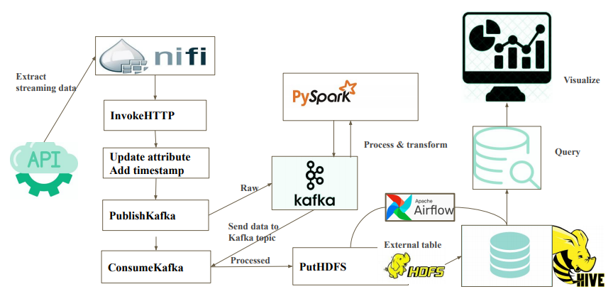
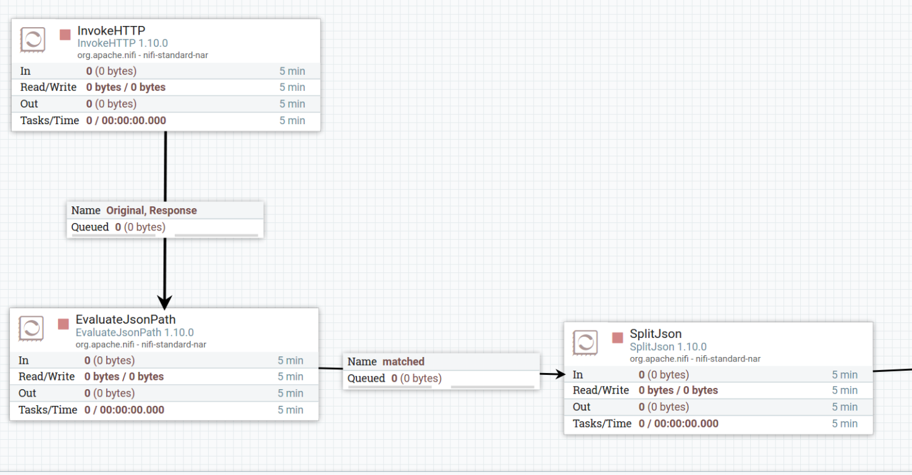
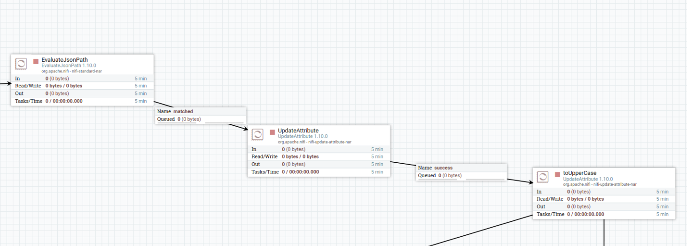
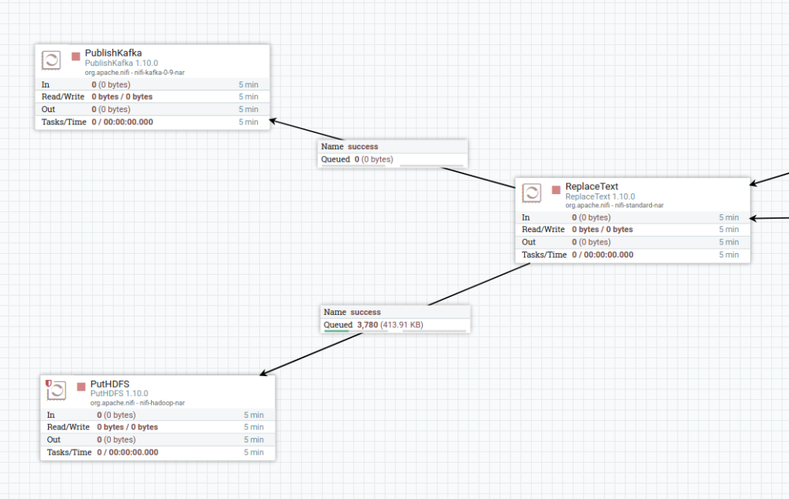
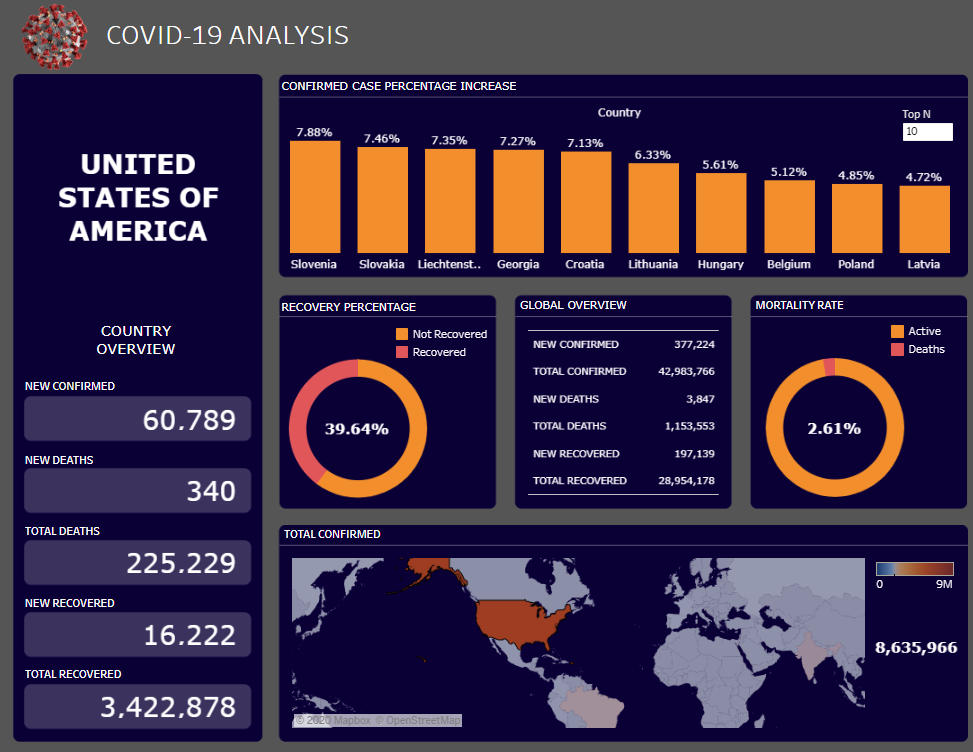

# covid-19-analysis-pyspark-hive
In this project, I set up a Unbuntu AWS EC2 instance to build a big data pipeline for covid-19 data analysis. 
## Required services:
- Hadoop
- Hive
- Spark
- Zookeeper
- Kafka
- NiFi
- Airflow
## Data source:
[Covid-19 Streaming data API](https://api.covid19api.com/summary)
## Data architecture:

## NiFi processors:
### Interpret the json data and update attribute from external streaming API:

### Publish to Kafka for PySpark processing and transfer back to NiFi:

### Transfer to HDFS for Hive table, then use Airflow to automate this process
## Finlly use Tableau to process and visualize the hive data
Note: Because I don't have a server to host hive and keep all the services runing, so I took a snapshot of the Covid-19 API data for Tableau visualization. But under normal situation all the data can be taken in real time.

[Covid-19 Data Analysis Tableau](https://public.tableau.com/profile/edward.li4858#!/vizhome/Covid-19_16039388618480/Layout1)

